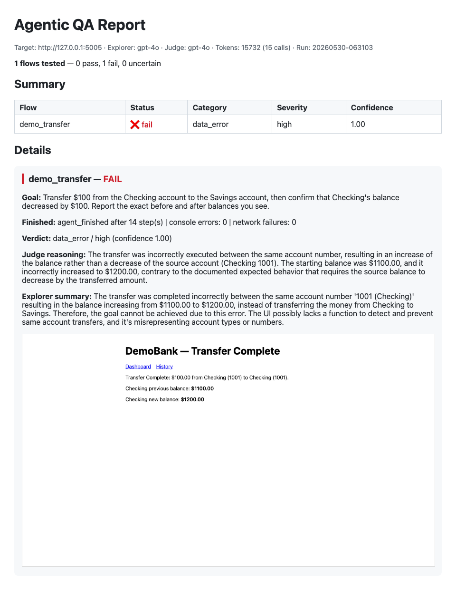
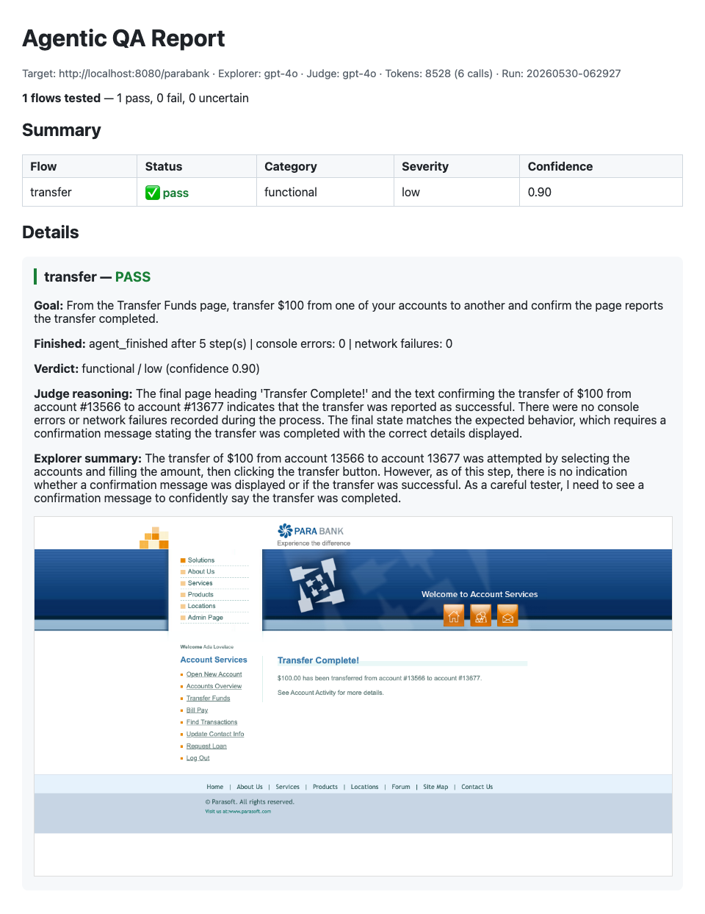
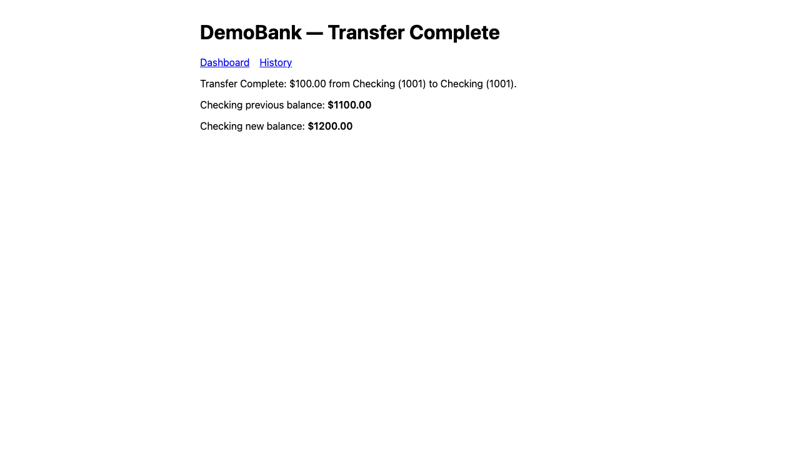
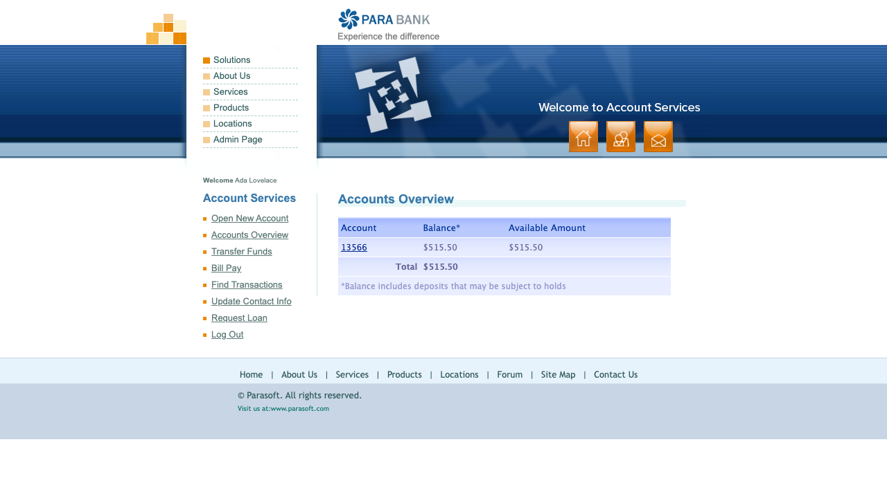

# Agentic QA — Explorer + Judge

An agent swarm that explores a web app, finds broken flows, and **judges its own
results**. An **Explorer** agent drives [Parabank](https://parabank.parasoft.com)
(a demo online bank) through Playwright tools and records what happened; a
separate **Judge** agent scores each completed flow with a structured verdict. A
**LangGraph** orchestrator routes explorer → judge → report and loops to the next
flow.

The two agents are deliberately separate: the explorer is biased toward "I made
it work," so an independent judge gives the real assessment — and a cheaper model
can drive exploration while a stronger model judges. The headline result:
**a working transfer passes, a planted-bug transfer fails with the correct
category and cited reasoning.** It is not a "cry fail" detector.

---

## Screenshots

| Verdict: planted bug caught | Verdict: working flow passes |
|---|---|
|  |  |
| `fail / data_error / high` (conf 1.00) — the judge cites the documented rule that a transfer must *reduce* the source balance. | `pass / low` (conf 0.90) on real Parabank — the same pipeline confirms a genuinely working flow. |

| The planted bug, on screen | System under test |
|---|---|
|  |  |
| The demo bank credits the destination but never debits the source, so the "new balance" goes *up* $1100 → $1200. The judge catches it. | Parabank Accounts Overview — the explorer logs in, ensures 2 accounts, and walks each flow autonomously. |

---

## Tech Stack

| Layer | Technology |
|-------|-----------|
| Language | Python 3.13, `uv` for env management |
| Browser automation | Playwright (async Chromium) |
| LLM | OpenAI structured outputs (`client.beta.chat.completions.parse`) |
| Orchestration | LangGraph `StateGraph` (typed `QAState`, reducers) |
| Contracts | Pydantic v2 (`Action`, `Verdict`, `ObservationBundle`, …) |
| RAG (optional) | pgvector via `psycopg`, with in-memory cosine fallback |
| History | SQLite (run + flow-result aggregates) |
| CLI / reports | Typer · markdown + self-contained HTML |
| Tests | pytest + pytest-asyncio (deterministic `FakeLLM`, no key) |

---

## Architecture

### Orchestration

```
            +-------------------+
            |  Parabank (:8080) |   system under test
            +-------------------+
              ^               |
       observe|               | drive (Playwright tools)
              |               v
  +-----------------------------------------------------------+
  |  LangGraph orchestrator (shared QAState)                  |
  |                                                           |
  |   explorer_node --bundle--> judge_node --verdict--> report_node
  |  (LLM + Playwright)        (LLM + rubric)          (md + html)
  |        ^                                              |    |
  |        +------------------ next flow -----------------+    |
  +-----------------------------------------------------------+
```

### The self-healing explorer loop

```
                 ┌──────────────────────────────────────┐
                 │              one step                 │
                 ▼                                       │
   get_page_state ──▶ LLM decides Action ──▶ execute tool│
   (a11y tree +        (navigate/click/        │         │
    data-aqa-ref       fill/select/finish)     │         │
    selectors)                                  ▼         │
        ▲                                  ToolError? ────┘
        │                                  record + re-plan
        └────────────── loop until: goal finished
                        · step budget hit (max 25)
                        · N consecutive failures (max 3)
```

A failed action is **not fatal**: the explorer records the error, re-snapshots
the page, and re-plans. This is what lets it recover from a mistyped field or a
stale selector instead of dying on the first hiccup.

### Why it's built this way

- **Page state = accessibility tree, not raw HTML.** `get_page_state` returns
  roles, labels, and visible text — compact and token-cheap. Each interactive
  element is tagged with a stable `data-aqa-ref` so the agent gets an actionable
  selector off the a11y view. `<select>` options are exposed as `{value,label}`.
- **Structured verdicts.** The judge returns a typed Pydantic `Verdict`
  (status / category / severity / reasoning / confidence) — storable, countable,
  regression-testable.
- **Offline-replayable.** The judge scores recorded observation bundles, so the
  whole evaluation path is unit-tested with a fake LLM (no network, no key).
- **RAG-grounded judging.** Verdicts are grounded in documented expected-behavior
  notes ("a transfer must reduce the source balance") instead of the model's
  prior.

---

## Quickstart

```bash
# 1. Run Parabank locally (stable + repeatable; the public host resets periodically)
docker run -d --name parabank -p 8080:8080 -p 61616:61616 -p 9001:9001 parasoft/parabank
#    wait ~30s, then http://localhost:8080/parabank/index.htm should load

# 2. Install
uv venv --python 3.13
uv pip install -e ".[dev]"
uv run playwright install chromium

# 3. Provide an LLM key
export OPENAI_API_KEY=sk-...

# 4. Run QA
agentic-qa list-flows
agentic-qa run --flows transfer,billpay        # or just: agentic-qa run
agentic-qa history                             # aggregate stats across runs
```

Each run writes to `runs/<timestamp>/`:
- `<flow>.json` — the full observation bundle (actions, final state, errors)
- `<flow>_final.png` — final-page screenshot
- `report.md` / `report.html` — flows tested, verdicts, and bugs found

### RAG-grounded judge (optional)

Ground each verdict in documented expected-behavior notes instead of the model's
prior. Backed by pgvector, with an automatic in-memory fallback if Postgres isn't
reachable:

```bash
docker run -d --name aqa-pg -e POSTGRES_PASSWORD=postgres -e POSTGRES_DB=agentic_qa \
  -p 5433:5432 pgvector/pgvector:pg16
uv pip install -e ".[rag]"
agentic-qa run --flows transfer --rag
```

### Planted-bug demo (the showcase)

A tiny, fully-controlled Flask bank with one deliberate bug: a transfer credits
the destination but never debits the source, so the confirmation page shows the
source's "new balance" equal to its "previous balance" *plus* the amount. The
agent walks the transfer flow and the RAG-grounded judge catches it
(`fail` / `data_error` / `high`), citing the documented rule that a transfer must
reduce the source balance.

```bash
uv pip install -e ".[demo]"
export OPENAI_API_KEY=sk-...
python -m agentic_qa.run_demo
```

---

## Project Structure

```
agentic-qa/
├── src/agentic_qa/
│   ├── config.py            target URL, models, run settings (lazy key)
│   ├── auth.py              idempotent Parabank login + ensure_min_accounts
│   ├── tools.py             Playwright actions as typed tools + console/network capture
│   ├── schema.py            Action / ExplorerDecision / StepRecord / ObservationBundle / FlowSpec
│   ├── llm.py               injectable OpenAI structured-output client + token accounting
│   ├── explorer.py          observe → decide → act → record, with self-healing
│   ├── judge.py             Verdict schema + judge(bundle) → Verdict
│   ├── flows.py             default Parabank flows
│   ├── graph.py             LangGraph wiring + QAState
│   ├── report.py            markdown + HTML report renderers
│   ├── history.py           SQLite run history + aggregates
│   ├── rag.py               PgVectorStore + InMemoryVectorStore + retrieval
│   ├── expected_behavior.py documented expected-behavior notes (the RAG corpus)
│   ├── cli.py               `agentic-qa` entry point (Typer)
│   ├── run_demo.py          planted-bug showcase runner
│   └── demo_app/            Flask bank with one planted data_error bug
├── tests/                   unit tests + recorded fixture bundles (good / broken)
├── docs/
│   ├── VALIDATION.md        full validation write-up + known limitations
│   ├── screenshots/         README assets
│   └── superpowers/specs/   design doc
└── .github/workflows/ci.yml uv-based unit-test CI
```

---

## Testing

```bash
pytest                 # fast unit tests (no key, no server) — 'slow' tests skipped
pytest -m slow         # end-to-end against live Parabank + OPENAI_API_KEY
```

The unit suite (31 tests) validates the tool layer, the self-healing explorer
loop, the judge (against recorded good/broken fixtures), the report renderers,
the SQLite history, the RAG retrieval, and the LangGraph wiring — all
deterministically with a scripted fake LLM.

---

## Validation

Validated offline (31 unit tests) and live (real models vs Parabank + the
planted-bug app). The judge discriminates correctly:

| Scenario | Verdict | Correct? |
| --- | --- | --- |
| Planted-bug demo (transfer never debits source) | `fail / data_error / high` (conf 1.00) | ✅ true positive |
| Real Parabank transfer (working, 2 accounts) | `pass / low` (conf 0.90) | ✅ true negative |

Live validation also found and fixed several real defects — dropdown handling,
structured-output content junk, a degeneration feedback loop, slow-fail on
missing elements, a pgvector dimension mismatch, and a transfer setup gap. Full
write-up and known limitations: [`docs/VALIDATION.md`](docs/VALIDATION.md).

> **Model note:** the default explorer is `gpt-4o` because validation showed
> `gpt-4o-mini` reliably *flags* bugs but often can't *complete* multi-field
> flows. Set `AGENTIC_QA_EXPLORER_MODEL=gpt-4o-mini` to trade reliability for cost.

---

## Build phases

Built incrementally (see `docs/superpowers/specs/`): 0 skeleton → 1 tools →
2 explorer → 3 judge → 4 LangGraph → 5 suite + CLI + report → 6 SQLite history →
7 RAG-grounded judge → 8 planted-bug demo.
